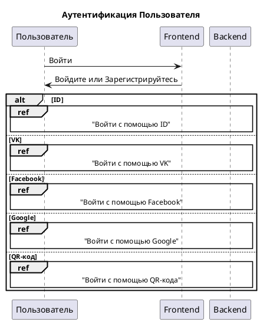

## Auth

```plantuml
@startuml Auth

title "Аутентификация Пользователя"

participant "Пользователь" as AuthUser
participant "Frontend" as Frontend
participant "Backend" as Backend

AuthUser -> Frontend : Войти
Frontend -> AuthUser : Войдите или Зарегистрируйтесь

alt ID
    ref over AuthUser, Frontend, Backend
        "Войти с помощью ID"
    end ref
else VK
    ref over AuthUser, Frontend, Backend
        "Войти с помощью VK"
    end ref
else Facebook
    ref over AuthUser, Frontend, Backend
        "Войти с помощью Facebook"
    end ref
else Google
    ref over AuthUser, Frontend, Backend
        "Войти с помощью Google"
    end ref
else QR-код
    ref over AuthUser, Frontend, Backend
        "Войти с помощью QR-кода"
    end ref
end

@enduml
```