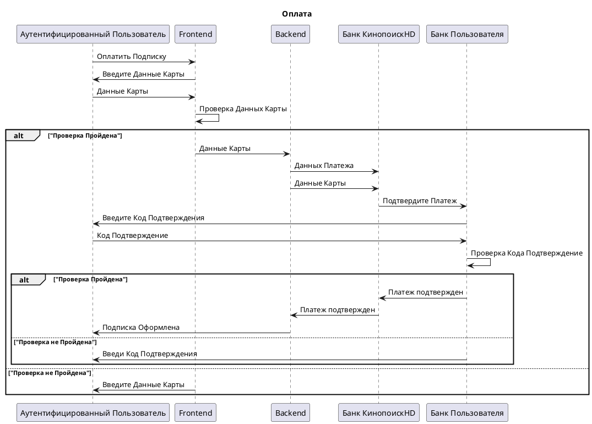

## Payment

```plantuml
@startuml Payment

title "Оплата"

participant "Аутентифицированный Пользователь" as AuthUser
participant "Frontend" as Frontend
participant "Backend" as Backend
participant "Банк КинопоискHD" as BankKinopoiskHD
participant "Банк Пользователя" as BankUser

AuthUser -> Frontend : Оплатить Подписку
Frontend -> AuthUser : Введите Данные Карты
AuthUser -> Frontend : Данные Карты
Frontend -> Frontend : Проверка Данных Карты
alt "Проверка Пройдена"
    Frontend -> Backend : Данные Карты
    Backend -> BankKinopoiskHD: Данных Платежа
    Backend -> BankKinopoiskHD: Данные Карты
    BankKinopoiskHD -> BankUser : Подтвердите Платеж
    BankUser -> AuthUser : Введите Код Подтверждения
    AuthUser -> BankUser : Код Подтверждение
    BankUser -> BankUser : Проверка Кода Подтверждение
    alt "Проверка Пройдена"
        BankUser -> BankKinopoiskHD : Платеж подтвержден
        BankKinopoiskHD -> Backend : Платеж подтвержден
        Backend -> AuthUser : Подписка Оформлена
    else "Проверка не Пройдена"
        BankUser -> AuthUser : Введи Код Подтверждения
    end
else "Проверка не Пройдена"
    Frontend -> AuthUser : Введите Данные Карты
end

@enduml
```