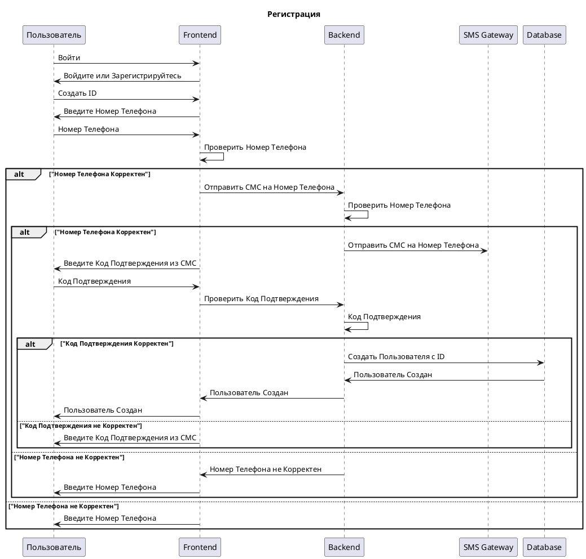

## Registration

```plantuml
@startuml Registration

title "Регистрация"

participant "Пользователь" as User
participant "Frontend" as Frontend
participant "Backend" as Backend
participant "SMS Gateway" as SMSGw
participant "Database" as DB

User -> Frontend : Войти
Frontend -> User : Войдите или Зарегистрируйтесь
User -> Frontend : Создать ID
Frontend -> User : Введите Номер Телефона
User -> Frontend : Номер Телефона
Frontend -> Frontend : Проверить Номер Телефона
alt "Номер Телефона Корректен"
    Frontend -> Backend : Отправить СМС на Номер Телефона
    Backend -> Backend : Проверить Номер Телефона
    alt "Номер Телефона Корректен"
        Backend -> SMSGw : Отправить СМС на Номер Телефона
        Frontend -> User : Введите Код Подтверждения из СМС
        User -> Frontend : Код Подтверждения
        Frontend -> Backend : Проверить Код Подтверждения
        Backend -> Backend : Код Подтверждения
        alt "Код Подтверждения Корректен"
            Backend -> DB : Создать Пользователя с ID
            DB -> Backend : Пользователь Создан
            Backend -> Frontend : Пользователь Создан
            Frontend -> User : Пользователь Создан
        else "Код Подтверждения не Корректен"
            Frontend -> User : Введите Код Подтверждения из СМС
        end 
    else "Номер Телефона не Корректен"
        Backend -> Frontend : Номер Телефона не Корректен
        Frontend -> User : Введите Номер Телефона        
    end
else "Номер Телефона не Корректен"
    Frontend -> User : Введите Номер Телефона
end 

@enduml
```