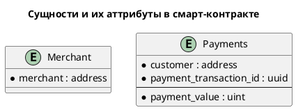
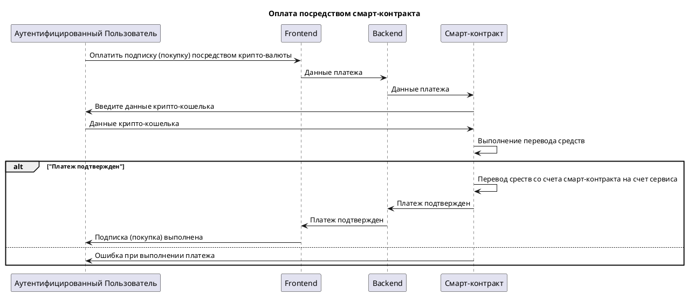

## Название

**Оплата** 

## Описание

Смарт-контракт **Оплата** предзнаначен для оплаты сервисов и продуктов **КинопоискHD** при помощи крипто-валюты.

Данная функциональность позволит осуществлять платежи за использование услуг сервиса минуя традиционные механизмы оплаты с использованием банковских сервисов типа Visa, Mastercard и т.п., что может оказаться актуальным в текущих условия блокирования работы этих сервисов на территории России.

## Основные функции

* Внесение оплаты за сервисы и продукты **КинопоискHD** в крипто-валюте.
* Получение информации о выполненных платежах.

## Основные сущности и их атрибуты в смарт-контракте

## UML-диаграмма последовательности

## Дополнительные идеи по развитию функциональности

* Добавить возможность автоматического перевода средств со счета смарт-контракта на счет сервиса по факту предоставления услуг (окончания очередного периода подписки, просмотра арендованного или купленного фильма).
* Добавить возможность выполнения периодических платежей (автоматическое продление подписки) в рамках работы смарт-контракта.
* Добавить возможность прекращения подписки и возврата неизрасходованных данных на крипто-кошелек отправителя.