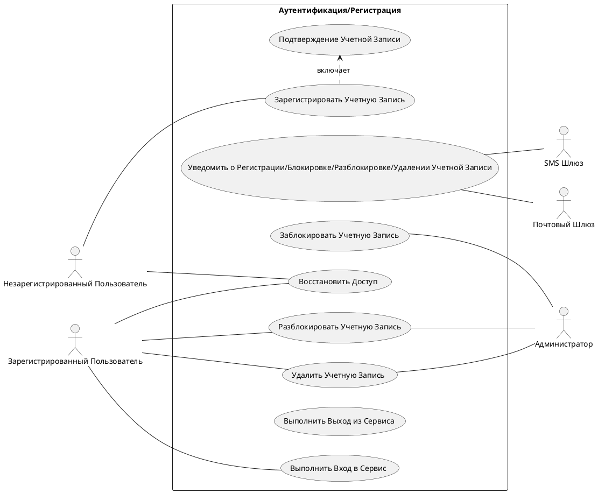

## Auth and Registration

```plantuml
@startuml Auth

left to right direction

actor "Незарегистрированный Пользователь" as NonRegisterUser
actor "Зарегистрированный Пользователь" as RegisterUser
actor "Администратор" as Admin
actor "Почтовый Шлюз" as MailGw
actor "SMS Шлюз" as SMSGw

rectangle "Аутентификация/Регистрация" {
    usecase "Зарегистрировать Учетную Запись" as UC1
    usecase "Подтверждение Учетной Записи" as UC2
    usecase "Уведомить о Регистрации/Блокировке/Разблокировке/Удалении Учетной Записи" as UC3
    usecase "Заблокировать Учетную Запись" as UC4
    usecase "Разблокировать Учетную Запись" as UC5
    usecase "Удалить Учетную Запись" as UC6
    usecase "Выполнить Вход в Сервис" as UC7
    usecase "Выполнить Выход из Сервиса" as UC8
    usecase "Восстановить Доступ" as UC9
}

UC1 .> UC2 : "включает"

NonRegisterUser -- UC1
NonRegisterUser -- UC9

RegisterUser -- UC5
RegisterUser -- UC6
RegisterUser -- UC7
RegisterUser -- UC9

UC3 -- MailGw
UC3 -- SMSGw

UC4 -- Admin
UC5 -- Admin
UC6 -- Admin

@enduml
```