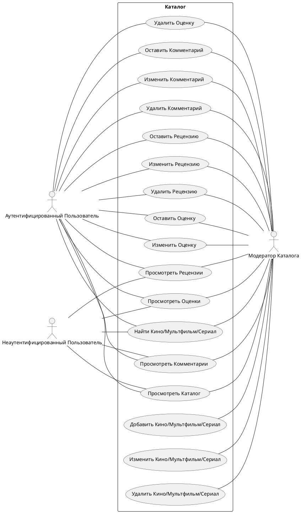

## Catalog

```plantuml
@startuml Catalog

left to right direction

actor "Аутентифицированный Пользователь" as AuthUser
actor "Неаутентифицированный Пользователь" as NonAuthUser
actor "Модератор Каталога" as Moderator

rectangle Каталог {
    usecase "Просмотреть Каталог" as UC1
    usecase "Просмотреть Рецензии" as UC2
    usecase "Оставить Рецензию" as UC3
    usecase "Изменить Рецензию" as UC4
    usecase "Удалить Рецензию" as UC5
    usecase "Просмотреть Оценки" as UC6
    usecase "Оставить Оценку" as UC7
    usecase "Изменить Оценку" as UC8
    usecase "Удалить Оценку" as UC9
    usecase "Просмотреть Комментарии" as UC10
    usecase "Оставить Комментарий" as UC11
    usecase "Изменить Комментарий" as UC12
    usecase "Удалить Комментарий" as UC13
    usecase "Найти Кино/Мультфильм/Сериал" as UC14
    usecase "Добавить Кино/Мультфильм/Сериал" as UC15
    usecase "Изменить Кино/Мультфильм/Сериал" as UC16
    usecase "Удалить Кино/Мультфильм/Сериал" as UC17
}

NonAuthUser -- UC1
NonAuthUser -- UC2
NonAuthUser -- UC6
NonAuthUser -- UC10
NonAuthUser -- UC14

AuthUser -- UC1
AuthUser -- UC2
AuthUser -- UC3
AuthUser -- UC4
AuthUser -- UC5
AuthUser -- UC6
AuthUser -- UC7
AuthUser -- UC8
AuthUser -- UC9
AuthUser -- UC10
AuthUser -- UC11
AuthUser -- UC12
AuthUser -- UC13
AuthUser -- UC14

UC1 -- Moderator
UC2 -- Moderator
UC3 -- Moderator
UC4 -- Moderator
UC5 -- Moderator
UC6 -- Moderator
UC7 -- Moderator
UC8 -- Moderator
UC9 -- Moderator
UC10 -- Moderator
UC11 -- Moderator
UC12 -- Moderator
UC13 -- Moderator
UC14 -- Moderator
UC15 -- Moderator
UC16 -- Moderator
UC17 -- Moderator

@enduml
```