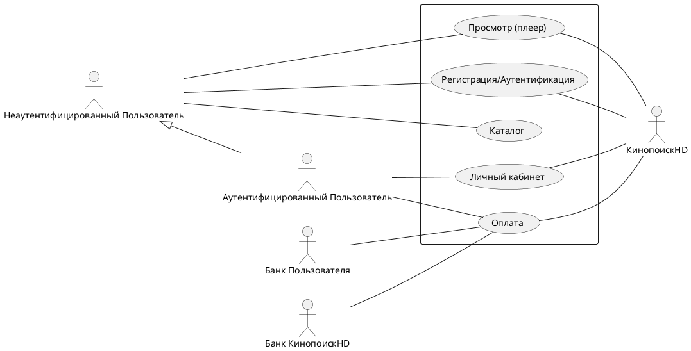

## Kinopoisk HD

```plantuml
@startuml KinopoiskHD

left to right direction

actor "Аутентифицированный Пользователь" as AuthUser
actor "Неаутентифицированный Пользователь" as NonAuthUser
NonAuthUser <|-- AuthUser
actor "Банк Пользователя" as BankUser
actor "Банк КинопоискHD" as BankKinopoiskHD
actor "КинопоискHD" as KinopoiskHD

rectangle {
    usecase "Каталог" as UC1  
    usecase "Просмотр (плеер)" as UC2  
    usecase "Регистрация/Аутентификация" as UC3
    usecase "Личный кабинет" as UC4
    usecase "Оплата" as UC5
}

NonAuthUser -- UC1
NonAuthUser -- UC2
NonAuthUser -- UC3

AuthUser -- UC4
AuthUser -- UC5

BankUser -- UC5
BankKinopoiskHD -- UC5

UC1 -- KinopoiskHD
UC2 -- KinopoiskHD
UC3 -- KinopoiskHD
UC4 -- KinopoiskHD
UC5 -- KinopoiskHD

@enduml
```
