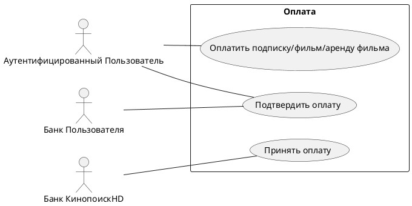

## Payment

```plantuml
@startuml Payment

left to right direction

actor "Аутентифицированный Пользователь" as AuthUser
actor "Банк Пользователя" as BankUser
actor "Банк КинопоискHD" as BankKinopoiskHD

rectangle Оплата {
    usecase "Оплатить подписку/фильм/аренду фильма" as UC1
    usecase "Подтвердить оплату" as UC2
    usecase "Принять оплату" as UC3
}

AuthUser -- UC1
AuthUser -- UC2

BankUser -- UC2

BankKinopoiskHD -- UC3

@enduml
```