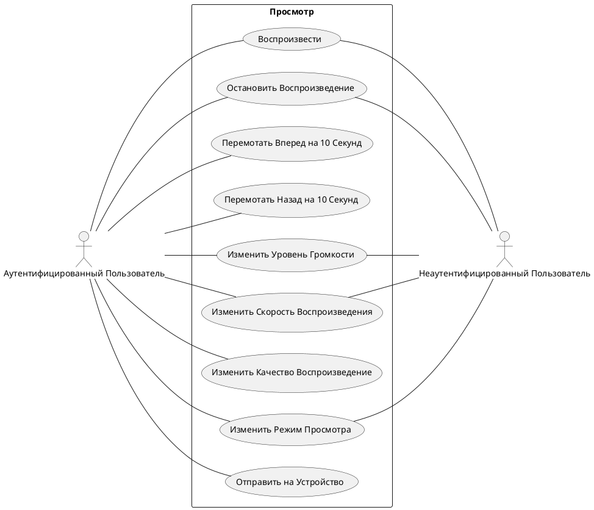

## Player

```plantuml
@startuml Player

left to right direction

actor "Аутентифицированный Пользователь" as AuthUser
actor "Неаутентифицированный Пользователь" as NonAuthUser

rectangle Просмотр {
    usecase "Воспроизвести" as UC1
    usecase "Остановить Воспроизведение" as UC2
    usecase "Перемотать Вперед на 10 Секунд" as UC3
    usecase "Перемотать Назад на 10 Секунд" as UC4
    usecase "Изменить Уровень Громкости" as UC5
    usecase "Изменить Скорость Воспроизведения" as UC6
    usecase "Изменить Качество Воспроизведение" as UC7
    usecase "Изменить Режим Просмотра" as UC8
    usecase "Отправить на Устройство" as UC9
}

AuthUser -- UC1
AuthUser -- UC2
AuthUser -- UC3
AuthUser -- UC4
AuthUser -- UC5
AuthUser -- UC6
AuthUser -- UC7
AuthUser -- UC8
AuthUser -- UC9

UC1 -- NonAuthUser
UC2 -- NonAuthUser
UC5 -- NonAuthUser
UC6 -- NonAuthUser
UC8 -- NonAuthUser

@enduml
```