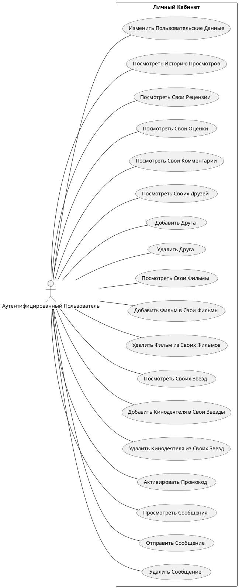

## Profile

```plantuml
@startuml Profile

left to right direction

actor "Аутентифицированный Пользователь" as AuthUser

rectangle "Личный Кабинет" {
    usecase "Изменить Пользовательские Данные" as UC1
    usecase "Посмотреть Историю Просмотров" as UC2
    usecase "Посмотреть Свои Рецензии" as UC3
    usecase "Посмотреть Свои Оценки" as UC4
    usecase "Посмотреть Свои Комментарии" as UC5
    usecase "Посмотреть Своих Друзей" as UC6
    usecase "Добавить Друга" as UC7
    usecase "Удалить Друга" as UC8
    usecase "Посмотреть Свои Фильмы" as UC9
    usecase "Добавить Фильм в Свои Фильмы" as UC10
    usecase "Удалить Фильм из Своих Фильмов" as UC11
    usecase "Посмотреть Своих Звезд" as UC12
    usecase "Добавить Кинодеятеля в Свои Звезды" as UC13
    usecase "Удалить Кинодеятеля из Своих Звезд" as UC14
    usecase "Активировать Промокод" as UC15
    usecase "Просмотреть Сообщения" as UC16
    usecase "Отправить Сообщение" as UC17
    usecase "Удалить Сообщение" as UC18
}

AuthUser -- UC1
AuthUser -- UC2
AuthUser -- UC3
AuthUser -- UC4
AuthUser -- UC5
AuthUser -- UC6
AuthUser -- UC7
AuthUser -- UC8
AuthUser -- UC9
AuthUser -- UC10
AuthUser -- UC11
AuthUser -- UC12
AuthUser -- UC13
AuthUser -- UC14
AuthUser -- UC15
AuthUser -- UC16
AuthUser -- UC17
AuthUser -- UC18

@enduml
```